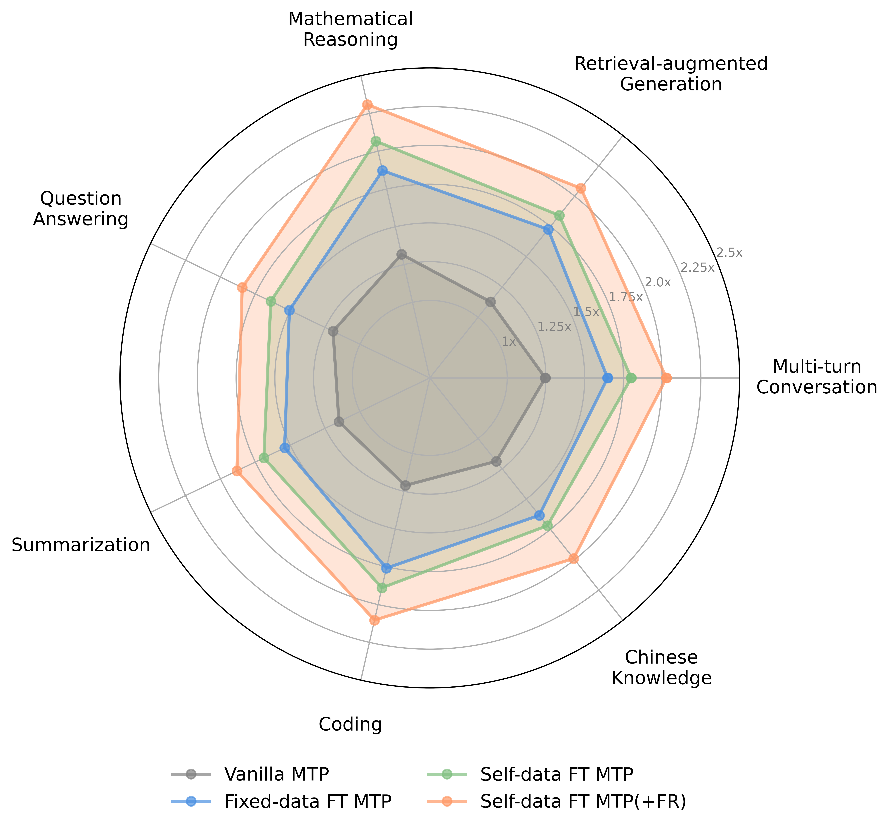

<div align="center">

# *FastMTP:* Accelerating LLM Inference with <br>Enhanced Multi-Token Prediction

<div align="center" style="line-height: 1;">

[](https://arxiv.org/abs/2509.18362)
[](https://huggingface.co/TencentBAC/FastMTP)
[](https://modelscope.cn/models/TencentBAC/FastMTP)

</div>

</div>

## Introduction

We present FastMTP, a simple yet effective method that enhances Multi-Token Prediction (MTP) for speculative decoding during inference. Our approach fine-tunes a single MTP head with shared weights across multiple causal draft steps, enabling it to capture longer-range dependencies and achieve higher acceptance rates in speculative decoding. By integrating language-aware vocabulary compression into the MTP head, we further reduce computational overhead during draft generation. Experimental results across diverse benchmarks demonstrate that FastMTP achieves an average of **2.03× speedup** compared over vanilla next token prediction while maintaining lossless output quality. With low training cost and seamless integration into existing inference frameworks, FastMTP offers a practical and rapidly deployable solution for accelerating LLM inference.

🌟 For more details, please refer to our [technical report](https://arxiv.org/abs/2509.18362).

<div align="center">
  
</div>
<div align="center">
<font color="gray">Speedup comparison of different methods across subtasks, evaluated on a single A10 GPU.</font>
</div>

## ⚙️ Installation

### Training Environment

Model training was performed on H20 GPUs with the following environment:

* `python 3.10`
* `torch 2.7.1+cu128`
* `flash_attn 2.8.2`

``` bash
conda create -n env-3.10 python=3.10 -y
conda activate env-3.10
pip install -r requirements.txt

cd ms-swift-3.6.4
pip install -e .

cd ..
cd transformers-4.54.0
pip install -e .
```

### Evaluation Environment

Evaluation experiments were mainly conducted on a single A10 GPU with the following environment:

* `python 3.12.11`
* `torch 2.8.0`
* `cuda 12.8`

``` bash
pip install sglang[all]
```

## 🚀 Getting Started

### Prepare model

Download the corresponding model weights to the ```model``` folder.

``` bash
# Make sure git-lfs is installed
cd model
git clone https://huggingface.co/XiaomiMiMo/MiMo-7B-RL

# Replace with our customized configuration
cp config.json MiMo-7B-RL/config.json
```

### Launch Training

``` bash
sh sft.sh
```

### Evaluation

#### Step 1: Launch a server

Start the server with the following command:

``` bash
export PYTORCH_CUDA_ALLOC_CONF=expandable_segments:True

python3 -m sglang.launch_server \
        --model-path <model_path> \
        --trust-remote-code \
        --mem-fraction-static 0.7 \
        --max-running-requests 1 \
        --tensor-parallel-size 1 \
        --cuda-graph-max-bs 1 \
        --speculative-algorithm EAGLE \
        --speculative-num-steps 3 \
        --speculative-eagle-topk 1 \
        --speculative-num-draft-tokens 4 \
        --speculative-token-map <freq_map_path>
```

* ```<model_path>```: Path to the model folder
* ```<freq_map_path>```: Path to the high-frequency token vocabulary

Note: Use the original ```config.json``` in ```<model_path>``` for evaluation.

Model weights are available on Huggingface ([see here](https://huggingface.co/TencentBAC/FastMTP)).

Processed language-aware high-frequency token vocabularies (based on the ```Qwen2Tokenizer```) are available for download on Huggingface:

* English: [Qwen2-7B-Instruct-FR-Spec](https://huggingface.co/thunlp/Qwen2-7B-Instruct-FR-Spec)
* Chinese: [MiMo-7B-RL-FR-Spec-zh](https://huggingface.co/TencentBAC/FastMTP/tree/main/fr_zh)

#### Step 2: Run the benchmark

Open a new terminal and execute:

``` bash
cd evaluation/<benchmark>
python3 bench_sglang_eagle.py

# Example: MT-Bench evaluation
cd evaluation/mt_bench
python3 bench_sglang_eagle.py \
  --question-file question.jsonl \
  --num-questions 80 \
  --temperature 0 \
  --max-gen-length 1024 \
  --answer-file <answer_file> \
  --result-file <result_file>
```

You can also send a request and stream the output:

``` python
import openai

client = openai.Client(base_url=f"http://127.0.0.1:{port}/v1", api_key="None")

# Use stream=True for streaming responses
response = client.chat.completions.create(
    model="default",
    messages=[
        {"role": "user", "content": "What is the capital of France?"},
    ],
    temperature=0,
    max_tokens=2048,
    stream=True,
)

# Handle the streaming output
for chunk in response:
    if chunk.choices[0].delta.content:
        print(chunk.choices[0].delta.content, end="", flush=True)
```

## Acknowledgments

* [ms-swift](https://github.com/modelscope/ms-swift) and [transformers](https://github.com/huggingface/transformers): Training frameworks we modified and built upon.
* [SGLang](https://github.com/sgl-project/sglang): Codebase used for inference.
* [EAGLE](https://github.com/SafeAILab/EAGLE) and [thunlp/FR-Spec](https://github.com/thunlp/FR-Spec): Key works that inspired our approach.
* [XiaomiMiMo/MiMo-7B-RL](https://huggingface.co/XiaomiMiMo/MiMo-7B-RL): Backbone model for our experiments.

## Citation

If you find the resources in this repository useful, please cite our paper:

``` bib
@article{cai2025fastmtp,
  title={FastMTP: Accelerating LLM Inference with Enhanced Multi-Token Prediction},
  author={Cai, Yuxuan and Liang, Xiaozhuan and Wang, Xinghua and Ma, Jin and Liang, Haijin and Luo, Jinwen and Zuo, Xinyu and Duan, Lisheng and Yin, Yuyang and Chen, Xi},
  journal={arXiv preprint arXiv:2509.18362},
  year={2025}
}
```
